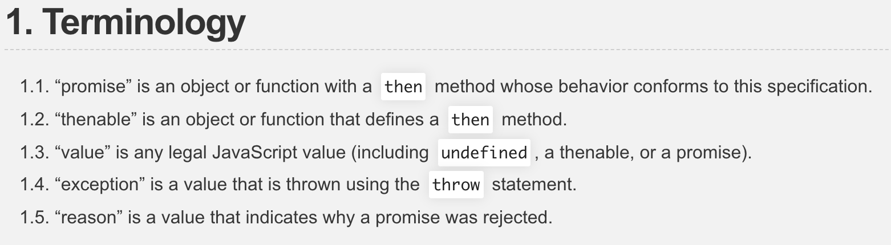

# Promise/A+实现

运行测试用例: `npm test`


## Promise 概念
Promise 对象用于表示一个异步操作的最终完成 (或失败), 及其结果值。

语法： `new Promise( function(resolve, reject) {...} /* executor */ );`

executor是带有 resolve 和 reject 两个参数的函数 。Promise构造函数执行时立即调用executor 函数， resolve 和 reject 两个函数作为参数传递给executor（executor 函数在Promise构造函数返回所建promise实例对象前被调用）。resolve 和 reject 函数被调用时，分别将promise的状态改为fulfilled（完成）或rejected（失败）。executor 内部通常会执行一些异步操作，一旦异步操作执行完毕(可能成功/失败)，要么调用resolve函数来将promise状态改成fulfilled，要么调用reject 函数将promise的状态改为rejected。如果在executor函数中抛出一个错误，那么该promise 状态为rejected。executor函数的返回值被忽略。

## Promise/A+实现
Promise/A+规范： https://promisesaplus.com/

### 测试用例
参考 https://github.com/promises-aplus/promises-tests ， 初始化一个项目，运行 `npm install --save-dev promises-aplus-tests` 安装测试用例

```json
// package.json
{
  //...
  "devDependencies": {
    "promises-aplus-tests": "^2.1.2"
  },
  "scripts": {
    "test": "promises-aplus-tests adapter"
  },
  // ...
}
```
```js
// adapter.js
// 导出 resolved, rejected, deferred 三个接口给测试用例使用
const Promise  = require('./promise');
​
const resolved = (value) => {
  return new Promise((resolve, reject) => {
    resolve(value);
  });
};
const rejected = (reason) => {
  return new Promise((resolve, reject) => {
    reject(reason);
  });
};
const deferred = () => {
  let promise, resolve, reject;
  promise = new Promise((_resolve, _reject) => {
    resolve = _resolve;
    reject = _reject;
  });
  return {
    promise,
    resolve,
    reject
  };
};
​
module.exports = {
  resolved,
  rejected,
  deferred
};
```

### Promise 术语



1. promise 是一个包含 then 方法的对象或函数，该方法符合规范指定的行为。
2. thenable 是一个包含 then 方法的对象或者函数。
3. value 就是任意合法 JS 值（包括 undefined, thenable, promise）。
4. exception 就是 throw 语句抛出的值。
5. reason 是一个表示 promise 为什么被 rejected 的值。

### Promise 状态


promise 有 3 种状态，分别是 pending, fulfilled 和 rejected。
* 在 pending 状态，promise 可以转换到 fulfilled 或 rejected。
* 在 fulfilled 状态，不能转换到其它状态，必须有个不可变的 value。
* 在 rejected 状态，不能转换到其它状态，必须有个不可变的 reason。

```js
const isFunction = (v) => (typeof v === 'function');
const isObject = (v) => (Object.prototype.toString.call(v) === '[object Object]');
const isThenable = (v) => ((isFunction(v) || isObject(v)) && ('then' in v));
const isPromise = (v) => (v instanceof Promise);
const PENDING = 'PENDING';
const FULFILLED = 'FULFILLED';
const REJECTED = 'REJECTED';
const toAsync = (fn) => (...args) => {
  setTimeout(() => {
    fn(...args);
  });
};
​
function Promise(executor) {
  this.state = PENDING;
  this.value = null;
  this.reason = null;
  this.onFulfilledCallbacks = []; // 下面 then 方法注册的
  this.onRejectedCallbacks = [];
  let isResolved = false;
​
  const resolve = (value) => {
    if (isResolved) return;
    isResolved = true;
​
    if (this.state === PENDING) {
      resolvePromise(this, value, (v) => { // 下面 The Promise Resolution Procedure 部分有具体实现
        this.state = FULFILLED;
        this.value = v;
        this.onFulfilledCallbacks.forEach(fn => fn());
      }, (r) => {
        this.state = REJECTED;
        this.reason = r;
        this.onRejectedCallbacks.forEach(fn => fn());
      });
    }
  };
  const reject = (reason) => {
    if (isResolved) return;
    isResolved = true;
​
    if (this.state === PENDING) {
      this.state = REJECTED;
      this.reason = reason;
      this.onRejectedCallbacks.forEach(fn => fn());
    }
  };
​
  try {
    executor(resolve, reject);
  } catch(err) {
    reject(err);
  }
}
```


### Then 方法

`promise.then(onFulfilled, onRejected)`

* onFulfilled 和 onRejected 都是可选参数， 不是函数的话就忽略。
* onFulfilled / onRejected 如果是函数，必须在 fulfilled / rejected 后执行一次。onFulfilled 的参数是 value，onRejected 函数的参数是 reason。
* onFulfilled or onRejected must not be called until the execution context stack contains only platform code（异步，可以用 macro-task 或者 micro-task）。
* onFulfilled 和 onRejected 必须作为函数调用 （i.e. with no this value）。
* promise 上的 then 可以调用多次，如果/当 promise fulfilled 后，onFulfilled 按注册顺序执行，如果/当 promise fulfilled 后，onRejected 按注册顺序执行。
* then 必须返回一个 promise。
  

```js
Promise.prototype.then = function (onFulfilled, onRejected) {
  onFulfilled = isFunction(onFulfilled) ? onFulfilled : (val => val); // 2.2.7.3
  onRejected = isFunction(onRejected) ? onRejected : (reason => { throw reason; }); // 2.2.7.4
  return new Promise((resolve, reject) => {
    switch (this.state) {
      case FULFILLED:
        toAsync(() => {
          try {
            let value = onFulfilled(this.value);
            resolve(value);
          } catch (reason) {
            reject(reason);
          }
        })();
        break;
      case REJECTED:
        toAsync(() => {
          try {
            let value = onRejected(this.reason);
            resolve(value);
          } catch (reason) {
            reject(reason);
          }
        })();
        break;
      case PENDING:
        this.onFulfilledCallbacks.push(toAsync(() => {
          try {
            let value = onFulfilled(this.value);
            resolve(value);
          } catch (reason) {
            reject(reason);
          }
        }));
        this.onRejectedCallbacks.push(toAsync(() => {
          try {
            let value = onRejected(this.reason);
            resolve(value);
          } catch (reason) {
            reject(reason);
          }
        }));
        break;
    }
  });
};
```

### The Promise Resolution Procedure


```js
function resolvePromise (promise, value, resolve, reject) {
  if (value === promise) { // 2.3.1
    reject(new TypeError('promise and value refer to the same object'));
  } else if (isPromise(value)) {
    value.then((value2) => { // 2.3.2
      resolvePromise(promise, value2, resolve, reject);
    }, reject);
  } else if (isThenable(value)) { // 2.3.3
    try {
      let then = value.then;
      if (isFunction(then)) {
        new Promise(then.bind(value)).then((value2) => {
          resolvePromise(promise, value2, resolve, reject);
        }, reject);
      } else {
        resolve(value);
      }
    } catch(err) {
      reject(err);
    }
  } else { // 2.3.4
    resolve(value);
  }
}
```

## ES6 Promise 提供的原型方法和静态方法

* Promise.prototype.catch
* Promise.prototype.finally
* Promise.resolve
* Promise.reject
* Promise.all
* Promise.race

```js
Promise.prototype.catch = function (onRejected) {
  return this.then(null, onRejected);
};
​
Promise.prototype.finally = function (fn) {
  return this.then((value) => {
    isFunction(fn) && fn();
    return value;
  }, (reason) => {
    isFunction(fn) && fn();
    throw reason;
  });
};
​
Promise.resolve = function (value) {
  return new Promise((resolve) => {
    resolve(value);
  });
};
​
Promise.reject = function (reason) {
  return new Promise((resolve, reject) => {
    reject(reason);
  });
};
​
Promise.all = function (promises) {
  if (!Array.isArray(promises)) throw new TypeError('expect promises to be an array');
​
  return new Promise((resolve, reject) => {
    if (!promises.length) {
      resolve([]);
    } else {
      let result = [];
      let resolvedCount = 0;
      promises.forEach((p, i) => {
        p.then((value) => {
          result[i] = value;
          resolvedCount++;
​
          if (resolvedCount === promises.length) {
            resolve(result);
          }
        }, (reason) => {
          reject(reason);
        });
      });
    }
  });
};
​
Promise.race = function (promises) {
  if (!Array.isArray(promises)) throw new TypeError('expect promises to be an array');
​
  return new Promise((resolve, reject) => {
    promises.forEach((p) => {
      p.then((value) => {
        resolve(value);
      }, (reason) => {
        reject(reason);
      });
    });
  });
};
```

## 参考
* https://developer.mozilla.org/zh-CN/docs/Web/JavaScript/Reference/Global_Objects/Promise
* https://promisesaplus.com/
* https://github.com/promises-aplus/promises-tests